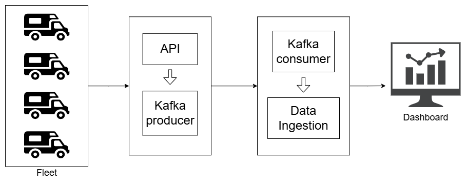

# FleetTrack

## Architecture

## Tools used

- FastAPI (Python)
- PostgreSQL
- Kafka
- Metabase/Streamlit/Tableau

## Setup

- Kafka and zookeeper are on docker - https://medium.com/@amberkakkar01/getting-started-with-apache-kafka-on-docker-a-step-by-step-guide-48e71e241cf2

## Features

- geofencing
- engine control module