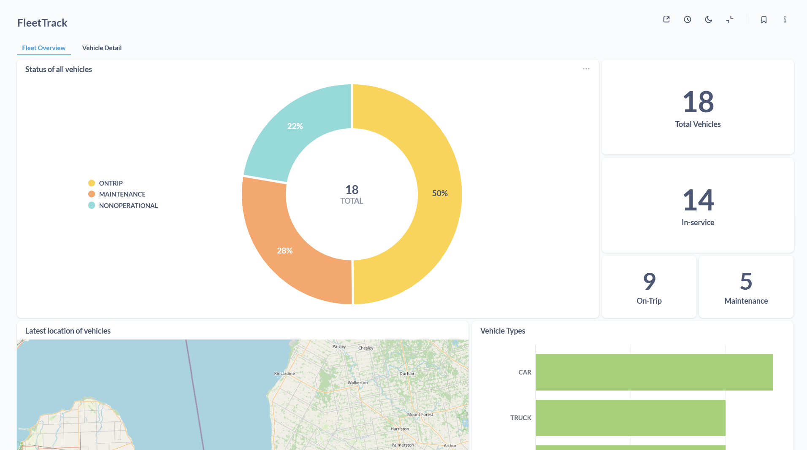
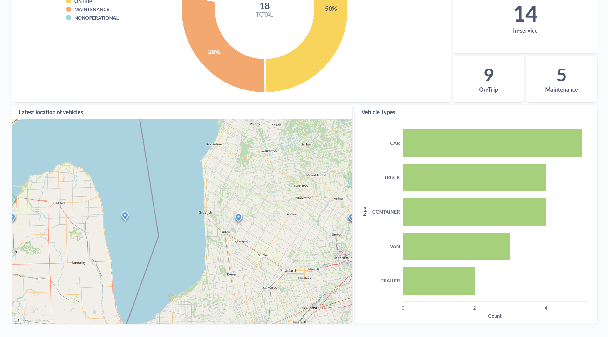
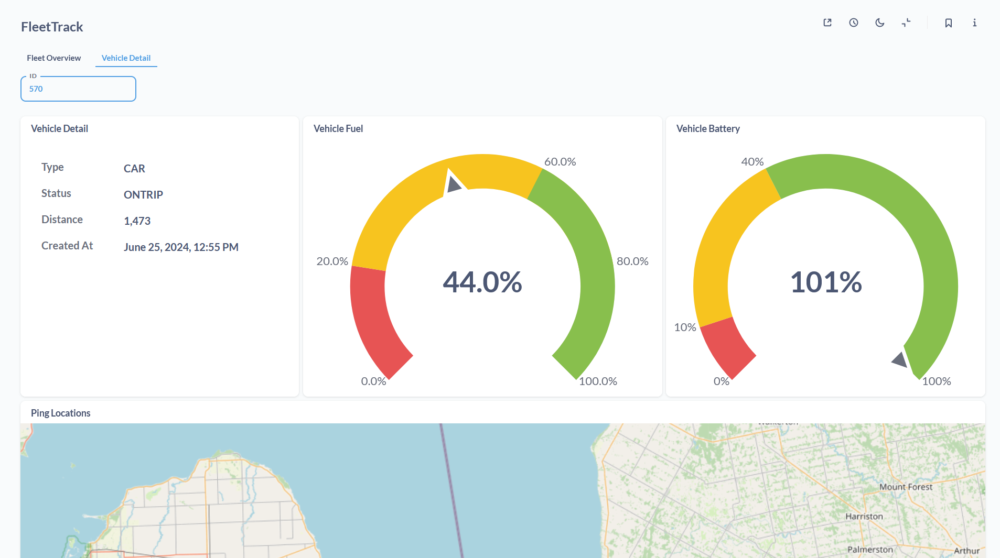
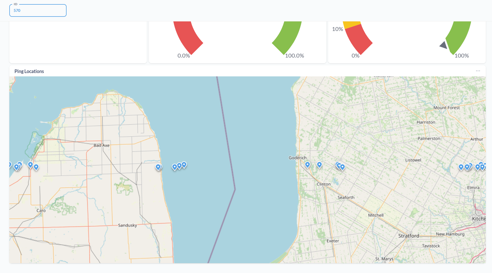

# FleetTrack

## Dashboard

### Tab 1

### Tab 2

## Architecture

## Tools used

- FastAPI (Python)
- PostgreSQL w/ Alembic
- Kafka
- Metabase

## Setup

- Start Kafka, Zookeeper, PostgreSQL and Metabase on Docker
  - `cd src`
  - `docker-compose up -d --build`
- Setup Python environment for the project and install dependencies from requirements.txt
- Create .env in root of project, use .env.example as a reference
- Initialize alembic to handle db migrations
  - `alembic init alembic`
  - `alembic revision -m "<message>"`
  - `alembic migrate head`

## Run the project

- Run scripts in the following order:
  - producer.py
  - consumer.py
  - run.py
- Open 